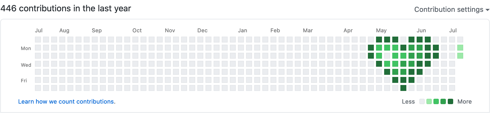
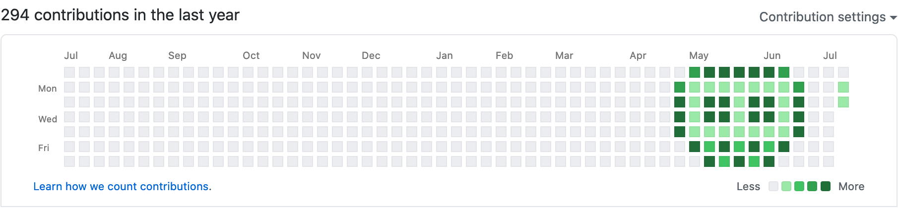
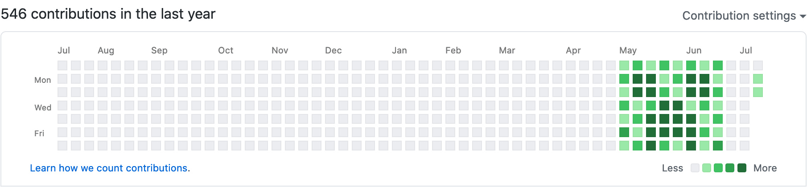
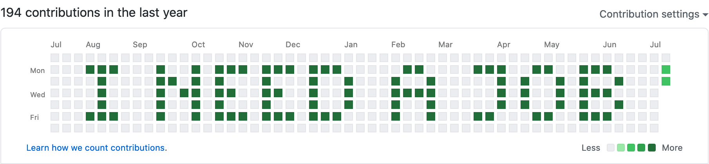

# Contribution

Draw an image on your GitHub contribution graph.

#### Examples

|             |             |
| ------------------------------------------- | ------------------------------------------- |
|         |  |


## How does it work?

GitHub displays commits in the contribution history graph. Contribution pushes 
a bunch of commits with a custom date using `git commit --date <date>`. It 
bundles multiple commits on a single day to achieve a darker pixel in the graph.

The GitHub contribution graph is 52 × 7 pixels and shows up to five shades for
activity. This app automatically limits the colors and dimensions of your input 
image to match these restrictions. Use the [preview](#contribution-preview--help) 
subcommand if you're not feeling lucky.

Warning: you cannot remove contribution activity on GitHub unless you delete a 
project, so you probably want to push to a project specifically created for 
this purpose. Contributions to secret projects may also be shown, depending on 
your GitHub settings.

Contribution uses your default SSH identity. If you want to use another identity,
you can do so by setting the [`GIT_SSH_COMMAND` and `GIT_AUTHOR_EMAIL` env variables.](https://gist.github.com/blaise-io/7a90dafb9ecee3022c8cf89e92b4dcc4)


## Download

You can find prebuilt binaries voor Windows, macOS and Linux in 
[releases](https://github.com/blaise-io/contribution/releases/latest).

Or clone the project and build yourself.

 - [Use the source image of these examples](image/source)
 - [Create your own using this palette image](image/source/palette.png)

If you don't have Paint installed you can use a free online tool like 
[pixilart.com](https://www.pixilart.com/draw).


## How to use

Contribution is provided as a binary with a command line interface.

<!-- The section below is added by `make README.md` -->
### `contribution -help`
```
Draw an image on your GitHub contribution history.
By Blaise Kal, 2021

Preview contribution history graph without pushing
  contribution preview -img /path/to/image.png
Preview usage and options
  contribution preview -help

Push contribution history graph to GitHub
  contribution push -img /path/to/image.png -project username/project
Push usage and options
  contribution push -help
```

### `contribution preview -help`
```
Preview contribution history graph without pushing.
Example usage:
  contribution preview -img image.png

  -img string
    	Path to a valid PNG image. (required)
```

### `contribution push -help`
```
Push contribution history graph to GitHub
Example usage:
  contribution push -project username/project

  -branch string
    	Git branch to push to. (default "contribution")
  -img string
    	Path to a valid PNG image. (required)
  -project string
    	GitHub username/project to push to. (required)
  -w int
    	Weeks ago of all activity. A value of 2 will move activity two pixels to the left.
```
